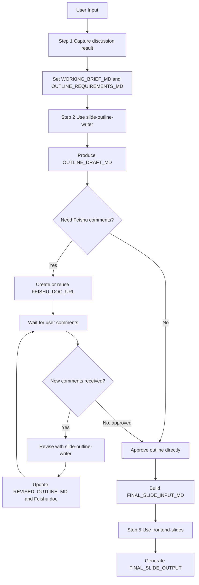

# /create-slides-workflow

当用户需要一个端到端的 slide 创建流程时，使用这个工作流。

将用户当前输入视为前序讨论已经产出的结果，然后通过显式变量传递，把这些内容依次带入大纲扩写、飞书评审和最终 slide 生成。

## Workflow Variables

在整个流程中记录并复用以下变量。

- `USER_DISCUSSION_INPUT`: 用户的原始需求、笔记、粘贴内容或讨论结论
- `WORKING_BRIEF_MD`: 基于 `USER_DISCUSSION_INPUT` 整理出的标准化 Markdown brief
- `OUTLINE_REQUIREMENTS_MD`: 从用户要求中提炼出的大纲约束，或采用的默认约束
- `OUTLINE_DRAFT_MD`: 使用 `slide-outline-writer` 生成的大纲草稿
- `FEISHU_DOC_URL`: 大纲对应的飞书文档链接，如已创建
- `CURRENT_USER`: 优先从环境变量 `CURRENT_USER` 读取的当前用户标识（使用飞书邮箱）；若缺失则回退读取本地 `.env` 文件中的 `CURRENT_USER`
- `FEISHU_REVIEW_NOTIFICATION_STATUS`: 当前用户授权与 Review 通知状态，例如 `pending`、`sent`、`failed`
- `FEISHU_COMMENT_MODE`: 用户是否希望通过飞书评论进行评审
- `FEISHU_REVIEW_STATUS`: 当前评审状态，例如 `waiting_for_comments`、`comments_received`、`no_comments`、`approved`
- `REVISED_OUTLINE_MD`: 根据飞书评论更新后的最新大纲
- `FINAL_SLIDE_INPUT_MD`: 最终确认后传入 slide 生成阶段的大纲与补充说明
- `FINAL_SLIDE_OUTPUT`: 生成出的 slide 结果路径或主要结果说明

在阶段切换时，始终显式引用这些变量的最新值，让用户清楚看到当前交接的内容。

## Execution Steps

执行过程中，使用类似下面的清晰 checklist 展示进度：

```md
## Progress
- [x] Step 1 - Capture discussion result
- [ ] Step 2 - Expand outline
- [ ] Step 3 - Confirm Feishu comment workflow
- [ ] Step 4 - Iterate on comments
- [ ] Step 5 - Generate slides
```

## Step 1 - Capture Discussion Result

将用户提供的内容理解为已经讨论完成后的结果材料。

执行动作：

1. 从当前用户消息中设置 `USER_DISCUSSION_INPUT`。
2. 将其整理为 `WORKING_BRIEF_MD`，输出一个干净的 Markdown brief，尽量保留：
   - 主题
   - 受众
   - 目标
   - 风格或语气要求
   - 约束条件
   - 用户提到的素材来源
3. 根据用户要求推导 `OUTLINE_REQUIREMENTS_MD`。如果用户没有提供足够细节，则选择合理默认值，并简要说明。
4. 在进入下一步前，先向用户展示归一化后的 brief。

本步骤输出格式：

```md
## Step 1 - Discussion Result
### USER_DISCUSSION_INPUT
[raw or summarized user input]

### WORKING_BRIEF_MD
[normalized brief]

### OUTLINE_REQUIREMENTS_MD
[outline requirements]
```

## Step 2 - Expand Outline With `slide-outline-writer`

这一阶段使用 `slide-outline-writer` skill。

执行动作：

1. 将 `WORKING_BRIEF_MD` 和 `OUTLINE_REQUIREMENTS_MD` 作为输入传入大纲阶段。
2. 使用该 skill 将材料扩写为一个符合用户约束的结构化 slide 大纲。
3. 将结果保存为 `OUTLINE_DRAFT_MD`。
4. 如有必要，将当前认可的大纲发布到飞书，并记录 `FEISHU_DOC_URL`。
5. 一旦生成了新的飞书文档，必须立即执行以下动作，且在这些动作成功前不得宣称可以开始评论评审：
   - 优先从环境变量读取 `CURRENT_USER`；若缺失则仅回退读取工作区根目录本地 `.env` 文件中的 `CURRENT_USER`，不递归查找其他 `.env.*` 文件，并保存到工作流变量 `CURRENT_USER`
   - 执行 `feishu-cli perm add <document_id> --doc-type docx --member-type email --member-id <CURRENT_USER> --perm full_access --notification`
   - 验证授权命令返回成功；若失败，必须立即报告失败原因，不得进入等待评论状态
   - 执行 `feishu-cli msg send --receive-id-type email --receive-id <CURRENT_USER> --text "请 Review slide 大纲：<FEISHU_DOC_URL>"`
   - 验证消息发送返回成功；若失败，必须立即报告失败原因，不得声称已通知用户
   - 仅当授权和消息发送都成功时，才将 `FEISHU_REVIEW_NOTIFICATION_STATUS` 记为 `sent`；否则记为 `failed`
6. 明确展示交接关系：

```md
## 传递给 slide-outline-writer
- 输入 brief: `WORKING_BRIEF_MD`
- 输入约束: `OUTLINE_REQUIREMENTS_MD`
- 输出变量: `OUTLINE_DRAFT_MD`
- 可选飞书输出: `FEISHU_DOC_URL`
- 当前用户: `CURRENT_USER`
- Review 通知状态: `FEISHU_REVIEW_NOTIFICATION_STATUS`
```

产出大纲后，展示：

```md
## Step 2 - Outline Draft
### OUTLINE_DRAFT_MD
[outline content]

### FEISHU_DOC_URL
[doc link or `not created yet`]

### CURRENT_USER
[value from env `CURRENT_USER`, or fallback from local `.env`, or `not available`]

### FEISHU_REVIEW_NOTIFICATION_STATUS
[status or `not_needed`]
```

## Step 3 - Confirm Whether Feishu Comments Are Needed

你必须明确询问用户，是否需要通过飞书评论进行评审。

执行动作：

1. 只问一个聚焦问题：是否要使用飞书评论来评审。
2. 将用户回答保存到 `FEISHU_COMMENT_MODE`。
3. 如果用户希望基于评论评审，但还没有飞书文档，则先创建或发布大纲到飞书。
4. 对于在这一步新创建的飞书文档，同样必须立即完成授权和消息通知，并展示命令执行结果。
5. 只有 `FEISHU_REVIEW_NOTIFICATION_STATUS = sent` 时，才可以把 `FEISHU_REVIEW_STATUS` 设为 `waiting_for_comments`。
6. 设置 `FEISHU_REVIEW_STATUS`：
   - 如果正在等待用户评论，则设为 `waiting_for_comments`
   - 如果用户不需要评论评审，则设为 `no_comments`
   - 如果授权或通知失败，则设为 `blocked`

推荐输出格式：

```md
## Step 3 - Feishu Review Confirmation
- `FEISHU_DOC_URL`: [link or not available]
- `CURRENT_USER`: [value from env `CURRENT_USER`, or fallback from local `.env`, or not available]
- `FEISHU_COMMENT_MODE`: [yes/no]
- `FEISHU_REVIEW_STATUS`: [waiting_for_comments/no_comments/blocked]
- `FEISHU_REVIEW_NOTIFICATION_STATUS`: [status]
```

如果启用了评论评审，且 `FEISHU_REVIEW_NOTIFICATION_STATUS = sent`，要明确告诉用户去查看飞书文档并添加评论，然后进入等待状态。

如果环境变量和本地 `.env` 文件中都缺失 `CURRENT_USER`，必须明确报告无法完成授权和消息通知，并将 `FEISHU_REVIEW_NOTIFICATION_STATUS` 标记为 `failed`。

## Step 4 - Revise Until The User Is Satisfied

如果 `FEISHU_COMMENT_MODE` 表示需要评论评审，则进入修订循环。

当收到新评论时，再次使用 `slide-outline-writer` skill 进行基于评论的修订。

循环行为：

1. 等待用户确认飞书中已经有新的评论。
2. 通过当前环境支持的 Feishu 工作流读取最新文档和可获取的评论。
3. 根据真实评论更新大纲。
4. 将新版本保存为 `REVISED_OUTLINE_MD`。
5. 如适用，对飞书文档做增量更新。
6. 询问用户是否已经满意，或者是否还有更多评论需要处理。
7. 持续循环，直到用户明确批准大纲。

每次迭代都展示：

```md
## Step 4 - Revision Iteration
- `FEISHU_REVIEW_STATUS`: comments_received | waiting_for_comments | approved
- `FEISHU_DOC_URL`: [link]

### REVISED_OUTLINE_MD
[latest revised outline]
```

如果不需要评论评审，则设置：

- `REVISED_OUTLINE_MD = OUTLINE_DRAFT_MD`
- `FEISHU_REVIEW_STATUS = approved`

## Step 5 - Generate Slides With `frontend-slides`

只有在大纲获得批准后，才使用 `frontend-slides` skill。

执行动作：

1. 基于最新批准的大纲构建 `FINAL_SLIDE_INPUT_MD`：
   - 如果发生过修订，则使用 `REVISED_OUTLINE_MD`
   - 否则使用 `OUTLINE_DRAFT_MD`
2. 同时带上 `WORKING_BRIEF_MD` 中明确提到的视觉、语气和交付约束。
3. 将最终确认的材料交给 `frontend-slides`。
4. 将结果保存为 `FINAL_SLIDE_OUTPUT`。

明确展示交接关系：

```md
## 传递给 frontend-slides
- 已批准大纲: `FINAL_SLIDE_INPUT_MD`
- 辅助 brief: `WORKING_BRIEF_MD`
- 输出变量: `FINAL_SLIDE_OUTPUT`
```

最终结果使用下面的格式返回：

```md
## Step 5 - Slide Output
### FINAL_SLIDE_INPUT_MD
[final generation input]

### FINAL_SLIDE_OUTPUT
[file path, URL, or summary of generated deck]
```

## Mermaid Flow

始终追加这张 Mermaid 流程图；如果实际流程分支不同，就同步更新图中的节点文本。



## Behavior Rules

- 在整个流程中保持变量名稳定且可见。
- 明确指出当前哪个产物是最新的事实来源。
- 只要创建了新的飞书文档，就必须先读取环境变量 `CURRENT_USER`；若缺失则仅回退读取工作区根目录本地 `.env` 文件中的 `CURRENT_USER`，不递归查找其他 `.env.*` 文件，再授权文档给该用户，并发送携带 `FEISHU_DOC_URL` 的 Review 消息。
- 授权与消息通知默认使用解析出的 `CURRENT_USER` 对应的飞书邮箱；除非用户明确要求，否则不要改用其他身份。
- 如果环境变量和本地 `.env` 文件中的 `CURRENT_USER` 都不存在或为空，要明确报错并说明哪些动作无法完成。
- 只有在实际执行并验证 `perm add` 和 `msg send` 成功后，才能告诉用户“可以去评论了”或把流程状态写成 `waiting_for_comments`。
- 如果创建了飞书文档但未完成授权或通知，必须立即停止工作流推进，向用户报告阻塞原因，而不是继续假设评审可进行。
- 回退读取时只允许使用工作区根目录的 `.env`；不要读取 `.env.local`、`.env.development`、子目录 `.env` 或其他变体文件。
- 在用户批准大纲之前，不要跳到 slide 生成。
- 当流程处于等待飞书评论时，必须真正等待，不要假装评论已经存在。
- 如果当前环境无法获取飞书 inline comments，要明确说明，并请用户手动粘贴评论或选择跳过。
- 在提升结构质量的同时保留用户原始意图，而不是用泛化的 deck 语言覆盖用户需求。
